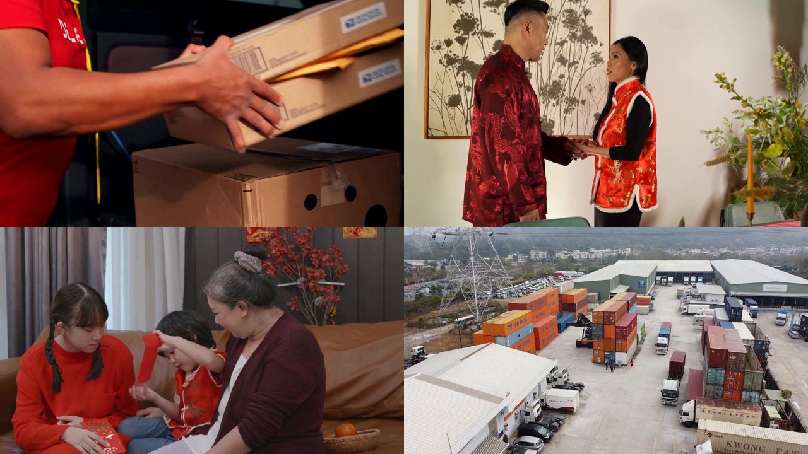

# mpt-text-to-video


把「一段文字描述 → 一条连贯短视频」跑通的 WorkBuddy 技能。底层用 [MoneyPrinterTurbo](https://github.com/harry0703/MoneyPrinterTurbo) 的 `--video-script` 模式，**免 LLM Key**、免付费配音，只需一个 Pexels API Key。

## 它能做什么

> 输入：「城市美食探店」「品牌产品宣传」这类主题/描述
> 输出：一条带中文配音、Pexels 素材拼接的短视频（`final-1.mp4`），横屏/竖屏可选

自动流水线：`分镜脚本 → 检索词 → Pexels 素材 → Edge TTS 中文配音 → 字幕(可选) → 拼接成片`



整条链路**只需一个 Pexels Key**，不依赖 OpenAI / Gemini / Whisper 等任何付费或重型服务。

## 为什么不需要 LLM

- `--video-script "<脚本>"`：直接喂分镜脚本，跳过 LLM 写脚本。
- `--video-terms "<词>"`：直接喂检索词，跳过 LLM 生成检索词。
- 字幕/配音默认用微软 **Edge TTS**（`zh-CN-XiaoxiaoNeural-Female`），免费、无需 Key。
- 素材源 `video_source="pexels"`，只需一个 Pexels Key。

## 安装到 WorkBuddy

把本仓库放到 WorkBuddy 的技能目录即可被识别（自动触发）：

```bash
# 用户级（跨项目）
cp -r mpt-text-to-video ~/.workbuddy/skills/

# 或项目级
cp -r mpt-text-to-video <你的项目>/.workbuddy/skills/
```

## 兼容性：其他 AI 也能用吗？

- **能自动识别**：实现了 skills 系统的 Agent —— WorkBuddy，以及 Claude Code / Codex 这类读取 `SKILL.md` 的客户端（本仓库的 `name` / `description` frontmatter 与它们兼容）。
- **不能直接自动识别，但照样能用**：ChatGPT 网页版、普通聊天机器人等。它们不会去扫 GitHub 的 `SKILL.md`，但本仓库的 `README.md` + `scripts/bootstrap.py` 是纯 Markdown + 纯 Python，**任何 AI 或人都能读、能跑**。把本仓库链接丢给任意 AI，说「按 README 帮我生成一个 XX 主题视频」即可。
- **跨平台 / 跨环境**：`bootstrap.py` 不依赖 WorkBuddy。在有 managed venv 的机器上复用它；否则自动在 `<repo>/.venv` 建隔离环境。Windows / macOS / Linux 均可用。

## 一键准备环境（可选但推荐）

`scripts/bootstrap.py` 会把「克隆 MoneyPrinterTurbo → 建隔离 venv → 装最小依赖 → 写入 config.toml」封装成一步，幂等可重复跑：

```bash
# WorkBuddy 环境
python scripts/bootstrap.py --repo <任意目录>/MoneyPrinterTurbo --key <你的PEXELS_KEY>

# 任意环境（venv 自动降级到 <repo>/.venv）
python scripts/bootstrap.py --repo ./MoneyPrinterTurbo
python scripts/bootstrap.py --repo ./MoneyPrinterTurbo --venv ./myenv --key <你的PEXELS_KEY>
```

最小依赖（刻意避开 faster-whisper / litellm / streamlit 等重型包）：
`openai edge_tts moviepy toml pydantic`

## 手动跑一条视频

```bash
# 解释器：优先用 bootstrap 建好的 venv
PY="$HOME/.workbuddy/binaries/python/envs/default/Scripts/python.exe"   # Windows + WorkBuddy
# PY="./MoneyPrinterTurbo/.venv/Scripts/python.exe"                      # Windows + 本地 venv
# PY="./MoneyPrinterTurbo/.venv/bin/python"                              # macOS / Linux

cd <你的>/MoneyPrinterTurbo
SCRIPT=$(cat script.txt)

"$PY" cli.py --video-script "$SCRIPT" \
  --video-terms "Chinese family,Chinese landscape,Chinese worker,Chinese logistics" \
  --video-aspect 16:9 --bgm-type none --no-subtitle-enabled --stop-at video
# 成片在 storage/tasks/<id>/final-1.mp4
```

## 关键参数

| 参数 | 取值 | 说明 |
|---|---|---|
| `--video-aspect` | `9:16` / `16:9` / `1:1` | 竖屏 / 横屏 / 方形 |
| `--video-terms` | 英文逗号分隔 | **必填**，否则走 LLM 报错 |
| `--bgm-type` | `none` / `random` | 无 BGM 素材时必须 `none` |
| `--no-subtitle-enabled` | （无值） | 关闭字幕 |
| `--voice` | `zh-CN-XiaoxiaoNeural-Female` 等 | 换音色 |
| `--stop-at` | `script`/`terms`/`materials`/`video` | 提前停看中间结果 |

## 分镜怎么写（决定成片质量）

- 每镜一行，整篇 4–8 行最稳；每行即一段配音 + 一段素材。
- 画面具体、有动作：「阳光洒进窗边小院」优于「这里很美」。
- 不要写镜头术语（「近景」「转场」），MPT 不解析，只写自然语言旁白。

## 踩坑记录

1. Python 用 managed venv 的解释器（`envs/default/Scripts/python.exe`），不是版本目录下的裸 python。
2. 必须显式 `--video-terms`，否则 `generate_terms` 走 LLM、无 Key 报错。
3. 默认 `bgm-type random` 需内置音乐文件，缺则报缺文件 → 加 `--bgm-type none`。
4. `open_task_folder_on_completion` 在无头/沙箱环境弹资源管理器会失败 → 设 `false`。
5. pip 清华源部分 wheel 返回 403 → 用 `https://mirrors.aliyun.com/pypi/simple/`。
6. 首次渲染 moviepy 会下载 ffmpeg 二进制，需联网。

## 获取 Pexels Key

注册 https://www.pexels.com/api/ 免费申请，把 Key 通过 `--key` 传入或写入 `config.toml` 的 `pexels_api_keys`。

## License

MIT
